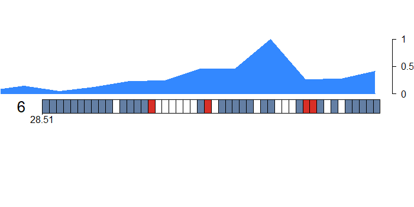

# GraphEval 

`GraphEval` is a software that assesses the quality of a pan-genome graph in terms of read alignments, memory usage, and time. Additionally, it offers comparative statistics for various pan-genome graphs. To perform the evaluation, GraphEval employs the `AStarix` sequence-to-graph aligner.

## Installation 

`git clone https://github.com/Dyotana19/GraphEval.git`\
`cd GraphEval`\
To compile Astarix, run `sh make_astarix.sh`

## Simulate Reads

To generate simulated reads from a genome file of your choice (in .fa or .fasta format) with a specified read length, number of reads, distribution, and output filename, you can execute the `simulate_reads.sh` script.
Make the script executable:
`chmod +x simulate.sh`
Run the script, passing the input filename, read length, number of reads, distribution and output filename as arguments, e.g.:
`./simulate.sh /global/homes/d/dyotana/Experiment/Reads/MHC_genomes/MHC-CHM13.0.fa 100 2 1 Errorfree_100bp_2reads.fa`

It will generate two reads of length 100 each from the given `MHC-CHM13.0.fa` file and will save the output in `Errorfree_100bp_2reads.fasta` file.

## Graph Evaluation 

`GraphEval.py` receives a reference graph and reads as input, and based on the read-to-graph alignment, it produces statistical information about the graph. The program currently accepts non-overlapping node graphs in `.gfa` format as reference, and linear reference graphs in `.fa/.fasta` format. Reads should be in `.fq/.fastq/.fasta` format. Additionally, the read-to-graph alignment is parallelized, and users can specify the number of threads to use depending on their resource availability.

To run this use `python graphEval.py`.
To ensure proper execution, the reference graphs must be stored in the `GraphEval/Graphs` directory, and the reads should be placed in the `GraphEval/Reads` folder. The output of the read-to-graph alignment will be saved in the `GraphEval/output` directory. Additionally, a merged result of the alignments will be stored in the GraphEval directory with the name `Merge_toolname.tsv` for future use.

## Graphs Comparison

`graphComp` allows users to select alignment results from various graphs in the .tsv format and generates a kernel density estimation plot of the alignment costs. The resulting plot is saved as `kde_plot.png`.
To run this use `python graphComp.py`.

## Example run 

Using the seqrequester tool, we produced a set of simulated reads without errors, which are 1000 base pairs in length, from the human MHC genome. These reads can be accessed in the `GraphEval/Reads/input.fasta` file. Furthermore, we created graphs using three pan-genome graph building tools (minigraph, minichain1.1, and minichain1.2) with 59 MHC haplotypes. The resulting alignment data, saved in the `.tsv` format, was used to compare the graphs, and their respective files can be found in the `test` folder.

